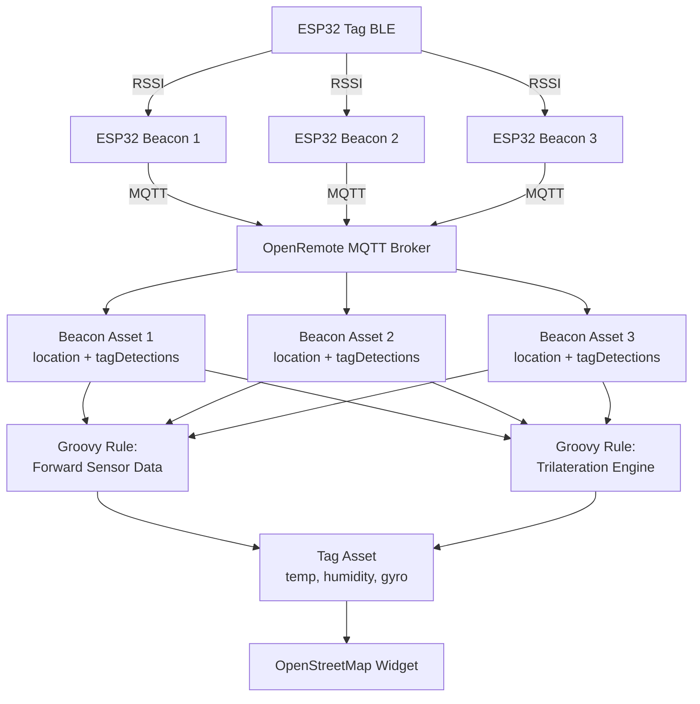
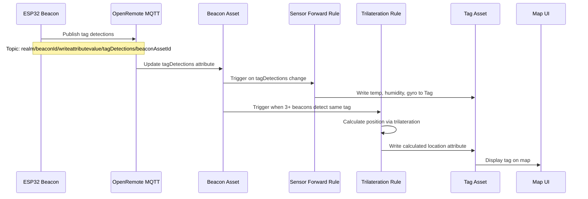

# Indoor Tracking System Implementation Plan

## Overview

This plan implements an indoor positioning system where multiple ESP32 beacons detect BLE tags via signal strength (RSSI), publish data to OpenRemote via MQTT, calculate tag positions using trilateration, and visualize everything on a map.

## Architecture Diagram



## Data Flow



---

## Phase 1: Asset Model Configuration

### 1.1 Update Beacon Asset Attributes

Add these attributes to the Beacon asset type in OpenRemote:

- **location** (GeoJSON Point) - Static beacon position as fake lat/lng
- **locationMeters** (JSON Object) - Physical location in room coordinates: `{x: float, y: float, z: float}`
- **tagDetections** (JSON Object) - Currently detected tags: `{tagMacAddress: {assetId: string, rssi: int, temp: int, humidity: int, gyro: {x,y,z}, timestamp: long}}`
- **detectionRadius** (Decimal) - Maximum detection range in meters (default: 10)

### 1.2 Update Tag Asset Attributes

Add/verify these attributes on Tag asset type:

- **macAddress** (Text) - BLE MAC address (unique identifier)
- **temperature** (Number) - Temperature in hundredths of °C
- **humidity** (Number) - Humidity in hundredths of %
- **gyro** (JSON Object) - Gyroscope data: `{x: int, y: int, z: int}`
- **signalStrength** (Number) - Last known RSSI (deprecated, kept for compatibility)
- **location** (GeoJSON Point) - Calculated position (fake lat/lng)
- **locationMeters** (JSON Object) - Calculated position: `{x: float, y: float, z: float}`
- **lastSeen** (Timestamp) - Last detection time
- **beaconCount** (Number) - Number of beacons currently detecting this tag

### 1.3 Create Indoor Tracking Group Asset

Create a new parent asset type "IndoorTrackingGroup" with these attributes:

- **referencePoint** (GeoJSON Point) - Building reference GPS coordinate
- **metersPerDegreeLat** (Decimal) - Conversion factor (default: ~111320 m/degree)
- **metersPerDegreeLng** (Decimal) - Conversion factor (varies by latitude, ~111320 * cos(lat))
- **minBeaconsForTrilateration** (Number) - Minimum beacons required (default: 3)
- **trilaterationUpdateInterval** (Number) - Update frequency in seconds (default: 2)

All Beacon and Tag assets should be children of this group asset.

---

## Phase 2: MQTT Message Structure Changes

### 2.1 Update ESP32 Beacon Code

Modify `beacon_v4.ino` to publish all tag detection data to the Beacon's own asset:

**Current behavior**: Publishes to tag asset

```
Topic: master/esp32-beacon-001/writeattributevalue/temperature/TAG_ASSET_ID
Payload: "2350"
```

**New behavior**: Publish to beacon asset with batched tag data

```
Topic: master/esp32-beacon-001/writeattributevalue/tagDetections/BEACON_ASSET_ID
Payload: {
  "AA:BB:CC:DD:EE:01": {
    "assetId": "TAG_ASSET_ID_1",
    "rssi": -65,
    "temperature": 2350,
    "humidity": 6050,
    "gyro": {"x": 100, "y": 150, "z": 120},
    "timestamp": 1703012345678
  }
}
```

**Files to modify**:

- [`beacon_v4.ino`](beacon_v4.ino) - Change `publishToOpenRemote()` function to batch all data into single JSON payload for tagDetections attribute
- [`mqtt_beacon_emulator.py`](mqtt_beacon_emulator.py) - Update `publish_sensor_data()` to match new format

### 2.2 Handle Multiple Tags per Beacon

Current code already handles multiple tags via MAC-to-Asset mapping. Extend to accumulate all detected tags in memory, then publish batched updates every N seconds.

---

## Phase 3: Groovy Rules Implementation

### 3.1 Rule 1: Sensor Data Forwarding

**Purpose**: Forward sensor data from Beacon's tagDetections to individual Tag assets

**Trigger**: When any Beacon's `tagDetections` attribute changes

**Logic**:

```groovy
// Pseudo-code structure
def tagDetections = beacon.getAttribute("tagDetections")
tagDetections.each { macAddress, detection ->
    def tagAssetId = detection.assetId
    def tagAsset = assets.get(tagAssetId)
    
    tagAsset.setAttribute("temperature", detection.temperature)
    tagAsset.setAttribute("humidity", detection.humidity)
    tagAsset.setAttribute("gyro", detection.gyro)
    tagAsset.setAttribute("lastSeen", detection.timestamp)
}
```

**File location**: Create in OpenRemote UI or as Groovy file in `setup/src/demo/` or `manager/src/main/resources/` directory

### 3.2 Rule 2: Trilateration Engine

**Purpose**: Aggregate signal strengths from multiple beacons and calculate tag position

**Trigger**: When any Beacon's `tagDetections` changes AND tag is detected by 3+ beacons

**Logic**:

1. Scan all Beacon assets for their `tagDetections`
2. Group by tag MAC address
3. For each tag detected by >= 3 beacons:

   - Extract beacon positions (x, y, z) and RSSI values
   - Convert RSSI to distance using path loss formula:
     ```
     distance = 10 ^ ((referenceRSSI - actualRSSI) / (10 * pathLossExponent))
     ```

   - Run trilateration algorithm (least squares or iterative approach)
   - Convert calculated (x, y, z) to fake lat/lng using referencePoint
   - Update Tag asset's `location` and `locationMeters`

**Algorithm**: Non-linear least squares trilateration

```groovy
// Pseudo-code
def calculatePosition(beacons, rssiValues) {
    def distances = rssiValues.collect { rssi -> rssiToDistance(rssi) }
    
    // Use 3D trilateration
    // Initial guess: average of beacon positions
    def guess = averagePosition(beacons)
    
    // Iterative optimization
    for (iteration in 1..10) {
        // Calculate error
        def totalError = 0
        def gradientX = 0, gradientY = 0, gradientZ = 0
        
        beacons.eachWithIndex { beacon, i ->
            def estimatedDistance = distance(guess, beacon.location)
            def error = estimatedDistance - distances[i]
            totalError += error * error
            
            // Gradient descent
            def dx = 2 * error * (guess.x - beacon.x) / estimatedDistance
            def dy = 2 * error * (guess.y - beacon.y) / estimatedDistance
            def dz = 2 * error * (guess.z - beacon.z) / estimatedDistance
            
            gradientX += dx
            gradientY += dy
            gradientZ += dz
        }
        
        // Update guess
        guess.x -= 0.1 * gradientX
        guess.y -= 0.1 * gradientY
        guess.z -= 0.1 * gradientZ
    }
    
    return guess
}
```

### 3.3 Rule 3: Coordinate Conversion

**Purpose**: Convert room meters (x, y, z) to fake GPS coordinates (lat, lng)

**Logic**:

```groovy
def metersToLatLng(roomX, roomY, referencePoint, metersPerDegreeLat, metersPerDegreeLng) {
    def deltaLat = roomY / metersPerDegreeLat
    def deltaLng = roomX / metersPerDegreeLng
    
    return [
        lat: referencePoint.lat + deltaLat,
        lng: referencePoint.lng + deltaLng
    ]
}
```

**File to create**: `groovy_rules/IndoorTrilateration.groovy` or create via OpenRemote Rules UI

---

## Phase 4: Helper Functions and Utilities

### 4.1 RSSI to Distance Conversion

Use log-distance path loss model:

```groovy
def rssiToDistance(rssi, referenceRssi = -45, pathLossExponent = 2.0) {
    return Math.pow(10, (referenceRssi - rssi) / (10 * pathLossExponent))
}
```

### 4.2 3D Distance Calculation

```groovy
def distance3D(point1, point2) {
    def dx = point1.x - point2.x
    def dy = point1.y - point2.y
    def dz = point1.z - point2.z
    return Math.sqrt(dx*dx + dy*dy + dz*dz)
}
```

---

## Phase 5: Map Visualization Setup

### 5.1 Configure OpenStreetMap Widget

1. Add OpenStreetMap widget to dashboard
2. Configure to show Indoor Tracking Group and all child assets
3. Beacon assets will appear at their static locations
4. Tag assets will update in real-time as location attribute changes

### 5.2 Asset Markers Configuration

- **Beacons**: Blue markers, static, labeled with beacon ID
- **Tags**: Red/green markers (red if lastSeen > 30s old), moving, labeled with tag MAC

### 5.3 Initial Reference Point Setup

In OpenRemote UI, set the IndoorTrackingGroup's `referencePoint` attribute:

- Option 1: Use building's real GPS coordinates
- Option 2: Use arbitrary point (e.g., 40.0, -74.0) for testing

Calculate `metersPerDegreeLng` based on latitude:

```
metersPerDegreeLng = 111320 * cos(latitude * PI / 180)
```

---

## Phase 6: Testing and Validation

### 6.1 Test with Python Emulator

Use `mqtt_beacon_emulator.py` to simulate multiple beacons:

1. Run 3+ instances with different beacon locations
2. Configure same tag MAC address on all instances
3. Verify tagDetections updates on Beacon assets
4. Verify sensor data forwarded to Tag assets
5. Verify location calculation and map display

### 6.2 Validation Checklist

- [ ] Beacon assets receive tagDetections updates
- [ ] Tag assets receive sensor data from Rule 1
- [ ] Trilateration triggers with 3+ beacons
- [ ] Calculated location appears on map
- [ ] Real-time updates as RSSI changes
- [ ] Multiple tags handled independently

---

## Phase 7: Future Enhancements - Custom Indoor Map Widget

### 7.1 Create Custom Web Component

Create a TypeScript/JavaScript widget in `ui/component/`:

- Display floor plan image as background
- Overlay beacon and tag positions
- Real-time updates via WebSocket
- Click tags to view sensor data

### 7.2 Integration

- Register custom widget in OpenRemote
- Configure via dashboard editor
- Upload floor plan image as asset attachment

---

## Implementation Order

1. **Asset Configuration** (Phase 1) - Configure attributes in OpenRemote UI
2. **ESP32 Code Updates** (Phase 2) - Modify beacon code and test MQTT publishing
3. **Sensor Forwarding Rule** (Phase 3.1) - Get sensor data flowing to tags
4. **Trilateration Rule** (Phase 3.2, 3.3, Phase 4) - Implement position calculation
5. **Map Setup** (Phase 5) - Configure visualization
6. **Testing** (Phase 6) - Validate with emulators and real hardware
7. **Custom Widget** (Phase 7) - Optional future enhancement

---

## Key Files to Create/Modify

**New Files**:

- `manager/src/main/resources/org/openremote/manager/rules/IndoorTrilateration.groovy` - Main trilateration rule
- `manager/src/main/resources/org/openremote/manager/rules/SensorForwarding.groovy` - Sensor data forwarding
- `setup/src/demo/IndoorTrackingSetup.java` - Demo setup with sample assets (optional)

**Modified Files**:

- [`beacon_v4.ino`](beacon_v4.ino) - Change MQTT publishing structure
- [`mqtt_beacon_emulator.py`](mqtt_beacon_emulator.py) - Update to match new MQTT format

**Configuration**:

- OpenRemote UI: Create asset types, attributes, rules
- OpenRemote UI: Create IndoorTrackingGroup, Beacon, and Tag assets
- OpenRemote UI: Configure map dashboard

---

## Notes

- The system uses "fake" lat/lng coordinates to leverage OpenRemote's existing location/map infrastructure
- Minimum 3 beacons required for 2D trilateration, 4+ for accurate 3D positioning
- RSSI values are noisy - consider smoothing/filtering (moving average, Kalman filter) if jitter is problematic
- Path loss exponent (n=2.0) assumes free space; adjust to 2.5-3.5 for indoor environments with obstacles
- Groovy rules execute synchronously - if performance becomes an issue, consider external microservice approach